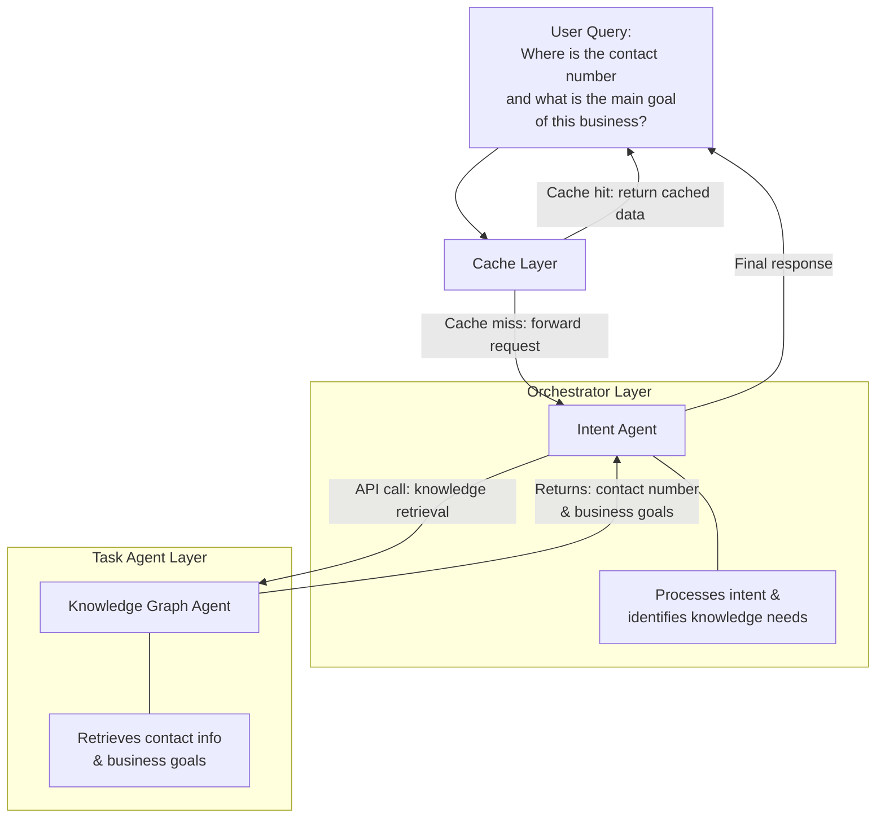

# Current Multi-Agent Orchestration Architecture

## Overview

This document describes the current low-level architecture for the multi-agent orchestration system along with plans for future enhancements.

---

## Current Architecture

- **Caching Layer:**  
  Intercepts incoming requests and serves cached results when available to reduce load on agents and improve response times.

- **Orchestrator Layer:**  
  Currently consists of a single **Intent Agent** which receives requests after cache misses and interprets user intent.

- **Task Agent Layer:**  
  Includes a **Knowledge Graph Agent** that the Intent Agent calls via API to fulfill tasks related to knowledge retrieval.

---

## Communication Flow

1. Request hits the **Caching Layer**.  
   - If cache hit: Returns cached response immediately without invoking agents.  
   - If cache miss: Passes request to **Intent Agent** in Orchestrator Layer.

2. **Intent Agent** processes the intent and sends an API call to the **Knowledge Graph Agent** in the Task Agent Layer.

3. **Knowledge Graph Agent** performs the required operations and returns the result back to the Intent Agent.

4. Intent Agent returns final response to the client.

---

## Architecture Diagram

---

## Planned Enhancements (Next Sprints)

- Expand the **Orchestrator Layer** to include a **Planner Agent** alongside the Intent Agent.  
  - Planner Agent will handle workflow decisions and delegate tasks across multiple specialized agents.

- Extend the **Task Agent Layer** by adding multiple specialized agents (e.g., Summarizer, Researcher, Notifier) to support complex multi-agent workflows.

- Implement enhanced **agent-to-agent (A2A) communication** protocols for flexible, dynamic orchestration.

- Incorporate advanced features such as:
  - Parallel and sequential task execution.
  - Fault tolerance, retries, and human-in-the-loop intervention.
  - Comprehensive multi-tenant tenant context propagation and isolation.

---

This phased approach ensures current system stability while planning scalable, maintainable multi-agent orchestration aligned with production-grade, multi-tenant SaaS architectures.
